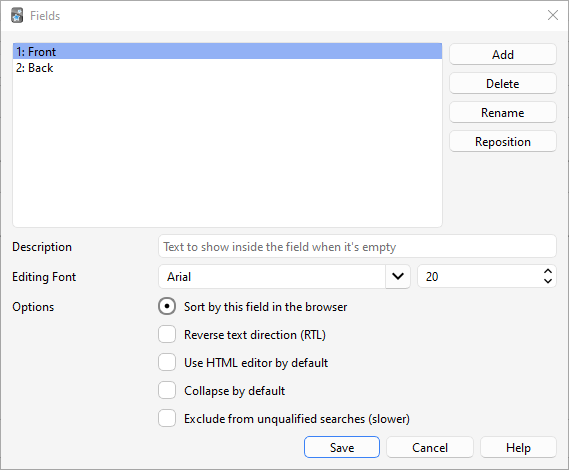
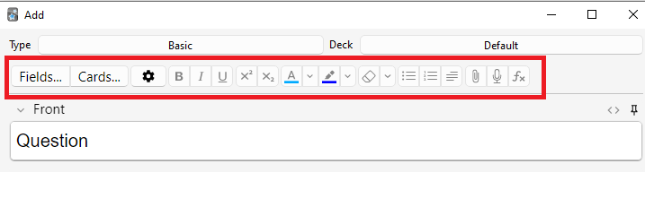
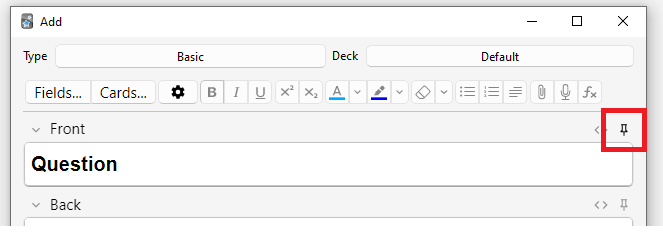

# 添加/编辑

> 原文：[Adding/Editing - Anki Manual (ankiweb.net)](https://docs.ankiweb.net/editing.html)

<!-- toc -->

## 添加卡片和笔记

回顾一下[基础知识](getting-started.md)，在 Anki 中，我们添加的是笔记而不是卡片，Anki 会为我们创建卡
片。点击[主窗口](studying.md#牌组)中的「添加」，将会出现添加笔记窗口。


窗口的左上角显示了当前的[笔记模板](getting-started.md#笔记模板)。如果不是「基础」，那么你可能在下载
共享牌组时添加了一些笔记模板。下面的文本假定你已经选择了「基础」。

窗口的右上角显示了将要添加卡片的[牌组](getting-started.md#牌组)。如果你想要将卡片添加到一个新的牌
组，可以点击牌组名称按钮，再点击「添加」。

在笔记模板下方，你会看到一些按钮，以及标有「正面」和「反面」的区域。正面和反面被称
为[字段](getting-started.md#笔记与字段)，你可以点击上方的「字段…​」按钮来添加、移除和重命名这些字
段。

字段下面是另一个标有「**标签**」的区域。标签是你可以附加到笔记上的标签，以便更容易组织和查找笔记。如
果愿意，可以将标签留空，或者添加一个或多个。标签由空格分隔。如果标签区域显示

    vocab check_with_tutor

…那么你添加的笔记将有两个标签。

当你在正面和反面输入文本时，你可以点击「添加」按钮，或按下 <kbd>Ctrl</kbd>+<kbd>回车</kbd>（在 Mac
上为 <kbd>Command</kbd>+<kbd>回车</kbd>），将笔记添加到你的集合中。当你这样做时，也会创建一张卡片，
并将其放入你选择的牌组中。如果你想编辑添加的卡片，可以点击历史按钮，在[浏览器](browsing.md)中搜索最
近添加的卡片。

有关笔记模板和字段之间按钮的更多信息，请参见[编辑器](editing.md)部分。

### 重复检查

Anki 检查第一个字段的唯一性，因此如果你输入了两个正面字段为「apple」的卡片，它会给出警告。唯一性检查
仅限于当前笔记模板，因此如果你正在学习多种语言，只要每种语言有不同的笔记模板，两个正面字段相同的卡片
不会被列为重复项。

由于效率问题，Anki 不会自动检查其他字段的重复，但浏览器有一个「查找重复」功能，你可以定期运行它。

### 有效学习

不同的人喜欢用不同的复习方式，但有一些通用的理念需要留意。一篇很好的介绍性文章是 SuperMemo 网站上
的[这篇文章](https://super-memory.com/articles/20rules.htm)。特别指出：

- **保持简单**：你的卡片越短，复习起来就越容易。你可能会因为「以防万一」而想要在卡片上涵盖大量信息，
  但随后的复习很快就会痛苦起来。

- **理解后再记忆**：如果你正在学习一门语言，尽量避免记忆超大的单词表。学习语言的最佳方式是在语境中学
  习，即看到这些单词如何用于句子中。同样，想象一下你在学习计算机课程。如果你试图记住大量的缩写词，你
  会发现很难取得进展。但如果你花时间去理解缩写词背后的概念，学习缩写词就会变得容易得多。

## 添加笔记模板

虽然基本的笔记模板足以满足每侧只有一个单词或短语的简单卡片，但当你想在正面或反面包括多于一个信息时，
最好将这些信息分成更多字段。

你可能会想「但我只想要一张卡片，为什么不能只在正面字段中包括音频、图片、提示和翻译？」如果你更喜欢这
样做，那也可以。但这种方法的缺点是所有信息都粘在一起。如果你想根据提示对卡片排序，就做不了了，因为它
与其他内容混在一起。你也无法做诸如将音频从正面移动到反面等操作，只能通过逐个复制和粘贴每张笔记来完
成。通过将内容保存在单独的字段中，你将来调整卡片布局时会更轻松。

要创建一种新类型的笔记，请从 Anki 的主窗口中点击「工具 → 管理笔记模板」。然后点击「添加」，添加一种
新的笔记模板。现在会看到另一个界面，它让你选择基于哪种笔记模板创建新模板。「添加」是指基于 Anki 自带
的模板创建。「复制」是指基于你集合中已经存在的模板创建。例如，如果你已经创建了法语词汇模板，你可能想
在创建德语词汇模板时复制那个。

选择确定后，你将被要求为新模板命名。与正在学习的主题材料有关的名称是不错的选择，比如「日语」、「琐
事」等。一旦你选择了名称，关闭笔记模板窗口，你将回到添加窗口。

## 自定义字段

要自定义字段，请在添加或编辑笔记时点击「字段…​」按钮，或在管理笔记模板窗口中选中笔记模板时点击。



点击相应的按钮可以添加、移除或重命名字段。要更改字段在此对话框和添加笔记对话框中出现的顺序，可以使用
重新定位按钮，该按钮询问你希望字段有的数值顺序。如果你想要更改字段为新的第一个字段，输入「1」。

不要使用「标签」、「类型」、「牌组」、「卡片」或「正面」作为字段名，因为它们
是[特殊字段](templates/fields.md#特殊字段)且无法正常工作。

窗口底部的选项允许你编辑添加和编辑卡片时将使用的字段的各种属性。这**不是**自定义卡片在复习时显示内容
的地方；要实现此目的，请查看[模板](templates/intro.md)。

- **编辑界面字体**允许你自定义编辑笔记时使用的字体和大小。这在你想要缩小不重要的信息，或增大难以阅读
  的外文字符时很有用。你在此处进行的更改不会影响卡片在复习时的显示：要做到这一点，请参见
  [模板](templates/intro.md)部分。不过，如果你启用了「输入答案」功能，你输入的文本将使用这里定义的字
  体大小。（有关如何更改输入答案时使用的实际字体样式的信息，请参
  见[检查答案](templates/fields.md#检查你的答案)部分。）

- **作为浏览器中的排序字段​**告诉 Anki 在浏览器的排序字段列中显示此字段。你可以使用此字段按该字段对
  卡片进行排序。一次只能有一个字段为排序字段。

- **文字方向从有至左**如果你正在学习从右到左（RTL）展示文本的语言，如阿拉伯语或希伯来语，这个设置很
  有用。目前该设置仅控制编辑；要确保文本在复习时正确显示，你需要调整你
  的[模板](templates/styling.md#文本方向)。

- **默认使用 HTML 编辑器**：如果你更喜欢直接在 HTML 中编辑字段，这会很有用。

- **默认折叠**。字段可以折叠/展开。动画可在[首选项](preferences.md)中禁用。

- **排除未限定条件的搜索（较慢）**：可用于希望某个字段的内容不在不限
  定[（不限于特定字段）](searching.md#限定到某个字段)的搜索结果中出现时。

在添加字段后，你可能想要将它们添加到卡片的正面或反面。更多信息请参见[模板](templates/intro.md)部分。

## 更改牌组/笔记模板

在添加期间，你可以点击左上角的按钮更改笔记模板，点击右上角的按钮更改牌组。打开的窗口不仅允许你选择牌
组或笔记模板，还可以添加新牌组或管理你的笔记模板。

## 组织内容

### 适当地使用牌组

[牌组](getting-started.md#牌组)旨在将你的内容分为想要分别学习的广泛类别，如英语、地理等。你可能倾向
于创建许多小牌组以保持内容有序，比如「我的地理书第 1 章」或「食物动词」，但不推荐这样做，原因如下：

- 许多小牌组可能会导致你以可识别的顺序看到卡片。在较旧的计划任务版本中，新卡只能按牌组顺序引入。如果
  你计划依次点击每个牌组（这样速度很慢），你会同时看到所有「第 1 章」或「食物动词」的复习。这使得回
  答卡片变得更容易，因为你可以从上下文中猜测，从而导致记忆力减弱。当你在 Anki 之外需要回忆单词或短语
  时，你并不总有机会先看到相关内容！

- 虽然这个问题比以前的 Anki 版本要小，但添加数百个牌组可能会导致减速，而拥有数千项目的非常大的牌组树
  实际上可能会在 2.1.50 之前的 Anki 版本中破坏牌组列表的显示。

### 使用标签

与创建许多小牌组相比，使用标签和/或字段分类内容是一个更好的主意。标签是一种有效提升搜索结果、查找特
定内容和保持集合有序的有用方式。有很多方法可以有效使用标签和标记，提前考虑你希望如何使用它们将帮助你
决定什么对你来说最好。

有些人更喜欢使用牌组和子牌组整理他们的卡片，但对于此目的使用标签相比牌组有一个很大的优势：你可以为单
个笔记添加多个标签，但单个卡片只能属于一个牌组，这使标签在大多数情况下成为比牌组更强大和灵活的分类系
统。你也可以将标签组织成树，[就像为牌组一样](getting-started.md#牌组)。

例如，与其创建一个「食物动词」牌组，不如将这些卡片添加到你的主要语言学习牌组，并用「食物」和「动词」
标记这些卡片。由于每张卡可以有多个标签，你可以做诸如[搜索](searching.md#标签牌组卡片和笔记)所有动
词、所有与食物相关的词汇、或所有与食物相关的动词这样的事情。

你可以从编辑窗口和[浏览器](browsing.md)中添加标签，也可以在其中添加、删除、重命名或组织标签。请注
意，标签在[笔记](getting-started.md#笔记与字段)级别工作，这意味着当你为有关联卡的卡片加上标签时，所
有关联卡都会被加上标签。如果你需要为单个卡片加标签，而不加上其兄弟，你应该考虑使用旗标代替。

### 使用旗标

旗标类似于标签，但会在复习界面的右上角中显示旗标的小图标。你还可以在浏览界面中搜索被旗标标记的卡片、
从浏览器中重命名旗标，以及从被旗标标记的卡片创建筛选牌组，但与标签不同的是，一张卡片在同一时间只能有
一个旗标。另一个重要的区别是旗标作用于[卡片](getting-started.md#卡片)级别，因此用旗标标记一张卡片不
会影响其关联卡。

你可以在复习模式中直接旗标 / 取消旗标卡片（在 Windows 上按 <kbd>CTRL</kbd> + <kbd>1-7</kbd> 或在 Mac
上按 <kbd>CMD</kbd> + <kbd>1-7</kbd>）以及从[浏览器](browsing.md)中进行操作。

### 「标记」标签

Anki 对名为「marked」的标签有特别处理。在复习界面和浏览界面中有选项可以添加或移除「marked」标签。当
当前卡片的笔记含有该标签时，复习界面会显示一个星号。而当笔记被标记时，卡片会在浏览界面中以不同的颜色
显示。

注意：标记主要是为了兼容早期的 Anki 版本；大多数用户会更倾向于使用[旗标](editing.md#使用旗标)。

### 使用字段

对于喜欢保持非常有条理的人，你可以在笔记中添加字段以分类你的内容，例如「书籍」、「页码」等等。Anki支
持在特定字段中搜索，这意味着你可以查找 `"book:my book" page:63`，快速找到你想要的内容。

### 自定义学习和筛选牌组

使用[自定义学习和筛选牌组](filtered-decks.md)，你可以根据搜索词创建临时牌组。这允许你大多数时候在单
个牌组中混合复习你的内容（以优化记忆效果），但也可以在需要专注于特定材料时创建临时牌组，例如考试前。
一般原则是如果你总是希望能单独学习某些内容，它应该在一个普通牌组中；如果你只偶尔需要单独学习（如测试
下、积压时等），那么从标签、标记、标记或字段创建的筛选牌组会更好。

## 编辑功能

添加笔记时、在复习时[编辑笔记](studying.md#编辑及更多)，或在[浏览](browsing.md)时会显示编辑器。



左上角有两个按钮，可以打开[字段](editing.md#自定义字段)和[卡片](templates/intro.md)窗口。

右侧是控制格式的按钮。粗体、斜体和下划线的工作方式与文字处理程序相同。接下来的两个按钮允许你下标或上
标文本，对化学式如 H<sub>2</sub>O 或简单的数学公式如 x<sup>2</sup> 很有用。再接下来，有两个按钮允许
你更改文本颜色。

橡皮擦按钮会清除所选文本上所有格式化的内容 — 包括文本的颜色，以及所选文本是否为粗体等。接下来的三个
按钮允许创建列表、文本对齐和文本缩进。

你可以使用回形针按钮从电脑的硬盘中选择音频、图像和视频，将它们附加到你的笔记中。或者，你可以将媒体复
制到电脑的剪贴板上（例如，通过在网页上右键单击图像并选择「复制图像」），然后将其粘贴进你想要放置的字
段中。有关媒体的更多信息，请参见[媒体](media.md)部分。

麦克风图标允许你从电脑的麦克风录音，并将录音附加到笔记中。

Fx 按钮显示添加 MathJax 或 [LaTeX](math.md) 到笔记中的快捷方式。

当选择关闭笔记模板时，\[…\] 按钮是可见的。


`</>` 按钮允许编辑字段的底层 HTML。


Anki 2.1.45+ 支持直接从编辑界面调整固定字段。如果你点击字段右侧的别针图标，Anki 将不会在添加笔记后清
除字段的内容。如果你发现自己在多条笔记中输入相同内容，你可能会发现此功能有用。在以前的 Anki 版本中，
固定字段是在字段界面中的切换。



大多数按钮都有快捷键。你可以将鼠标指针悬停在按钮上以查看其快捷键。

粘贴文本时，Anki 默认会保留大部分格式。如果在粘贴时按住 <kbd>Shift</kbd> 键，Anki 会去掉大多数格式。
你可以在首选项中切换「不按住 shift 键进行粘贴时删除格式」以修改默认行为。

## 完形填空

「完形填空」的过程是隐藏句子中的一个或多个词语。例如，如果你有句子：

    堪培拉成立于 1913 年

……然后你在「1913 年」上创建一个完形填空，则句子将变为：

    堪培拉成立于 [...]

有时以这种方式挖空的部分被称为「遮蔽」。

为什么你可能想要使用完形填空的更多信息，请参见
[这里](https://super-memory.com/articles/20rules.htm)的规则 5。

Anki 提供了一种特殊的完形填空类型的笔记，以便于创建完形填空。要创建一个完形填空笔记，选择填空笔记类
型，并在「文本」字段中输入一些文本。然后拖动鼠标选择要隐藏的文本，并点击 \[…\] 按钮。Anki 将用以下内
容替换文本：

    堪培拉成立于 {{c1::1913 年}}

「c1」部分表示你在这个句子上创建了一个完形填空。你可以创建多个挖空，如果你愿意。例如，如果你选择堪培
拉并再次点击 \[…\]，则文本现在看起来像这样：

    {{c2::堪培拉}}成立于 {{c1::1913 年}}

当你添加上述笔记时，Anki 将创建两张卡片。第一张卡片将显示：

    堪培拉成立于 [...]

……在问题上，完整的句子在答案上。另一张卡片在问题上有以下内容：

    [...]成立于 1913 年

你还可以在同一张卡片上遮蔽多个部分。在上面的例子中，如果你将 c2 改为 c1，将只创建一张卡片，同时隐藏
堪培拉和 1913 年。如果在创建完形填空时按住 <kbd>Alt</kbd> (在 Mac 上为 <kbd>Option</kbd>)，Anki 将自
动使用相同的编号而不递增。

挖空不需要在单词的边界上进行，因此如果你选择「培拉」而不是「堪培拉」，问题将显示为「堪\[…​\]成立于
1913 年」，给你一个提示。

你也可以给自己提示不匹配的文本。如果你用以下句子替换原句：

    堪培拉::城市成立于 1913 年

……然后在选中「堪培拉::城市」后按下 \[…​\]，Anki 会将冒号后面的文本视为提示，将其更改为：

    {{c1::堪培拉::城市}}成立于 1913 年

当卡片出现复习时，它将显示为：

    [城市]成立于 1913 年

有关测试你正确输入完形填空答案的方法，请参见[输入答案](templates/fields.md#检查你的答案)部分。

从版本 2.1.56 开始，支持嵌套完形填空。例如，以下是有效的：

    {{c1::堪培拉{{c2::成立}}}}于 1913 年

内部填空完全嵌套在外部填空中。不支持部分重叠，例如：

    [...]立于 1913 年-> 堪培拉成
    堪培拉[...]于 1913 年-> 成立

其中「成」出现在两个填空中。

在 2.1.56 版本之前，如果你需要从重叠文本创建完形填空，添加另一个文本字段到填空中，添加
到[模板](templates/intro.md)，然后在创建笔记时，将文本粘贴到两个独立的字段中，如下所示：

    文本 1 字段：{{c1::堪培拉成立}}于 1913 年

    文本 2 字段：{{c2::堪培拉}}成立于 1913 年

默认的填空笔记模板有一个名为「额外」的第二个字段，显示在每张卡片的答案侧。它可用于添加一些使用说明或
额外信息。

填空笔记模板被 Anki 特殊处理，并不能基于普通笔记模板创建。如果你希望自定义它，请确保复制现有的填空类
型，而不是其他类型的笔记。事物如格式可以自定义，但不能向填空笔记模板添加额外的卡片模板。

## 图像遮罩

Anki 23.10+ 原生支持图像遮罩卡片。图像遮罩（IO）笔记是基于图像的完形填空的特殊情况，允许你创建卡片，
隐藏图像的某些部分，测试你对隐藏信息的知识。


### 添加图像

要将图像遮罩卡片添加到你的集合中，打开添加界面，点击「类型」，从内置笔记模板列表中选择「图像遮罩」。
然后，点击「选择图像」以加载保存于电脑硬盘上的图像文件，或点击「从剪贴板粘贴图像」如果你已将图像复制
到剪贴板上。

### 添加图像遮罩卡片

加载图像后，图像遮罩编辑器将打开。点击左侧的图标，向图像添加所需数量的区域。有三个基本形状可供选择：

- 矩形
- 椭圆形
- 多边形

你还可以为每个笔记选择两种不同的图像遮罩模式：

- **隐藏所有，猜一个**：所有区域都被隐藏，同时仅显示一个区域进行学习。
- **隐藏一个，猜一个**：每次仅隐藏一个区域，并将在学习时显示。其他区域将可见。


完成后，点击窗口底部的「添加」按钮。Anki 会为你在上一步添加的每个形状或形状组添加一张卡片，你可以开
始正常复习。

## 编辑图像遮罩笔记

你可以通过在复习时点击「编辑」或直接从浏览器中编辑你的图像遮罩笔记。这里有几个工具供你使用。值得注意
的有：

- 选择：它允许你选择一个或多个形状以移动、调整大小、删除或分组它们。
- 缩放：你可以自由移动图像并使用鼠标滚轮放大或缩小。
- 形状（矩形、椭圆形或多边形）：使用它们添加新的形状 / 卡片。
- 文本：它将文本区域添加到图像中。这些文本区域可以移动、调整大小或删除，但使用此工具时不会创建卡片。
- 撤销 / 重做。
- 放大 / 缩小 - 重置缩放。
- 切换透明度：使用此工具临时查看隐藏区域。
- 删除：使用此工具删除所选形状和文本区域。请注意，删除形状不会自动删除其关联的卡片；你需要之后使用工
  具 > 清空卡片，正如常规完形填空一样。
- 复制。
- 分组选定：使用此工具创建一个形状簇，允许你同时移动、调整大小或删除它们。请注意，一旦分组，两个或两
  个以上的单一形状将只创建一张卡片。
- 解组选定：选择一个组，然后点击此按钮以使每个形状再次独立。
- 对齐：此工具可用于根据需要对齐你的形状 / 文本区域。

在复习图像遮罩卡片时，「切换遮罩」按钮会出现在图像正下方。当使用「隐藏所有，猜一个」模式时，这个按钮
会临时清除笔记的所有形状。

## 输入外语字符和重音符

所有现代计算机都内置支持输入重音符和外语字符，并提供多种方法。我们推荐的方法是使用你想学语言的键盘布
局。

具有独立字符集的语言，如日语、中文、泰语等，有它们专有的布局。欧洲语言中使用重音符号的语言可能有自己
的布局，不过通常可以在一般的「国际键盘」布局上输入。这种输入方法是先键入重音符号，然后输入你想要标重
音的字符，例如，先输入省略号 (') 再输入字母 a (a)，这样就得到 á。

要在 Windows 机器上添加国际键盘，请参见
<https://thegeekpage.com/how-to-add-us-international-keyboard-in-windows-10/>

要在 Mac 上添加，请参见 <http://www.macworld.com/article/1147039/os-x/accentinput.html>

特定语言的键盘添加方式类似，但我们无法在此全部覆盖。更多信息请尝试在 Google 上搜索「input Japanese
on a mac」、「type Chinese on Windows 10」等等。

如果你正在学习一种从右到左书写的语言，需要考虑更多因素。请参
见[此页面](http://dotancohen.com/howto/rtl_right_to_left.html)获取更多信息。

Anki 所构建的工具包在处理某些输入法时有困难，比如在 macOS 上按住按键选择重音字符，或者在 Windows 上
按住 <kbd>Alt</kbd> 键并输入数字代码来输入字符。

## Unicode 正规化

像 `á` 这样的文本可以在计算机上以多种方式表示，例如使用该符号的特定代码，或者使用标准的 `a` 并加上另
一个重音符的代码。这在合并来自不同来源的输入或使用不同计算机时会导致问题——如果你的计算机以一种形式处
理键盘输入，但内容以不同形式存储，尽管最终结果看起来相同，但在搜索时将无法匹配。

为了确保内容可以轻松地在搜索中找到，Anki 会将文本规范化为标准形式。对大多数用户来说，这个过程是透明
的，但如果你在学习某些特定材料，比如古日文符号，这个正规化过程可能会将它们转换为更现代的等价物。

如果你希望保留字符变体，可以在[调试控制台](./misc.md)中执行以下操作来关闭正规化：

```python
mw.col.conf["normalize_note_text"] = False
```

在此之后添加的任何内容将保持不变。权衡之下，如果你在不同操作系统之间切换，或从混合来源粘贴内容，可能
会发现难以搜索这些内容。
