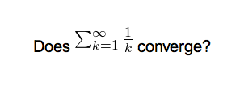
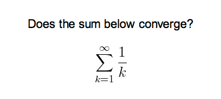

# 数学和符号

<!-- toc -->

## MathJax

[MathJax](https://www.mathjax.org) 是一个现代的基于浏览器的排版系统，适用于数学和化学方程。它不需要
安装任何额外的软件，因此非常易于使用，并且推荐给大多数用户。

Anki 2.1+、AnkiMobile 和 AnkiDroid 2.9+ 中已开箱即用地支持 MathJax。

尝试使用它：

1. 在一个字段中输入以下内容：

\sqrt{x}

2. 选择你刚刚输入的文本。

3. 点击编辑器中最右侧的按钮，从菜单中选择「MathJax inline」。Anki 会将文本更改为：

\(\sqrt{x}\)

4. 如果你点击「卡片…」按钮，你会看到卡片复习时方程的预览。

Anki 的 MathJax 支持期望内容为 TeX 格式。如果你不熟悉 TeX 格式，请查看
[这个速查表](https://math.meta.stackexchange.com/questions/5020/mathjax-basic-tutorial-and-quick-reference)。
请注意，第二点在 Anki 中不适用——Anki 使用 `\(` 和 `\)` 表示行内方程，使用 `\[` 和 `\]` 表示显示方
程。

如果你想在 MathJax 表达式中使用换行符，请用 <kbd>Shift</kbd>+<kbd>Enter</kbd>，而不是仅仅使用
<kbd>Enter</kbd>，因为普通的换行符会导致 MathJax 无法正常工作。

Anki 内置了对 mhchem 的支持来渲染化学方程。请参见『化学方程』部分和以下章节以获取更多信息：
<https://mhchem.github.io/MathJax-mhchem/>

可以[自定义一些设置](https://faqs.ankiweb.net/customizing-mathjax.html)。

## LaTeX

LaTeX 是一个强大的排版系统，适用于输入数学公式、化学公式、音乐符号等。Anki 提供了一些对 LaTeX 的支
持，允许你在笔记中输入 LaTeX 代码。当你复习卡片时，Anki 会调用 LaTeX 并显示生成的图像。

设置 LaTeX 需要更多的工作，并且图像只能由计算机版本的 Anki 生成——不过一旦生成，这些图像就可以在移动
端显示。由于 LaTeX 带来的额外复杂性，只推荐需要比 MathJax 提供的更多功能的用户使用。

### 安全警告

LaTeX 代码可能包含恶意命令，可能会读取或写入你计算机上的非 Anki 数据。因此，最新版的 Anki 默认拒绝生
成 LaTeX 图像。

如果你希望在自己的卡片上使用 LaTeX，需要在偏好设置界面启用『生成 LaTeX 图像』选项。

**我们强烈建议不要在使用共享牌组或计划将来导入共享牌组时启用此选项，因为你可能会给任何共享牌组的作者
访问你的计算机的权限**。

对于共享牌组不需要启用此选项。如果共享牌组的作者在分享牌组之前已正确生成所有图像，图像应该已经可用
了。

### 预备知识

Anki 的 LaTeX 支持并非即插即用：假定你已经知道如何使用 LaTeX，并且已经安装了它。如果你没有 LaTeX 经
验，请查阅互联网中众多可用指南。如果你在标记上遇到困难，请在 LaTeX 论坛上进行询问。

在 Windows 上，使用 MiKTeX 安装 LaTeX；在 macOS 上使用 MacTeX，在 Linux 上使用发行版的包管理器。还必
须安装 dvipng。

在 Windows 上，进入 MikTeX 的维护窗口，确保「Install missing packages on the fly」设置为「Always」，
而不是「Ask me first」。如果问题仍然存在，有用户反馈以管理员身份运行 Anki 直到获取所有包有所帮助。

在 macOS 上，仅在 MacTeX 和 BasicTeX 上测试过 LaTeX。如果你使用 BasicTeX，需要单独安装 dvipng，使用
以下命令：

sudo tlmgr update --self; sudo tlmgr install dvipng

该命令可能不在路径上，所以你可能需要提供完整路径，例如
/usr/local/texlive/2014basic/bin/x86_64-darwin/tlmgr。

如果没有使用上述 LaTeX 包，你需要使用 [edit LaTeX](https://ankiweb.net/shared/info/937148547) 插件来
指定 latex 和 dvipng 的完整路径。

### 网页/移动设备

当你复习带有 LaTeX 的卡片时，Anki 会为该 LaTeX 生成一个图像，并将图像放在你的集合的媒体文件夹中以供
将来使用。网页和移动客户端将显示这些已有的图像，但无法自行生成图像。

为了避免在其他客户端学习之前必须至少复习所有的卡片一遍，Anki 可以为你批量生成图像。要生成所有图像，
请转到工具 &gt; 检查媒体。之后，同步应将生成的媒体上传到 AnkiWeb 和其他客户端。

### 示例

输入 LaTeX 内容最常用的方法是用 \[latex\] \[/latex\] 标签将其包裹。编辑器部分记录了快捷按钮。

\[latex\] 标签必须在字段中使用——将它们放在卡片模板中会[导致问题](templates/fields.md)。

例如，在 Anki 抽认卡正面输入以下内容：

    [latex]\begin{math}\sum\_{k = 1}^{\infty}\frac{1}{k}\end{math}[/latex] 收敛吗？

当查看抽认卡时，将会生成：

上例中的公式称为文本公式，因为它直接显示在非数学文本中。相对地，以下示例显示的是显示公式：

    下面这个求和是否收敛？

    [latex]\begin{displaymath}\sum\_{k = 1}^{\infty}\frac{1}{k}\end{displaymath}[/latex]

『文本公式』和『显示公式』是最常见的 LaTeX 表达式类型，因此 Anki 为它们提供了缩略版本。形式为：

    [latex]\begin{math}...\end{math}[/latex]

可以缩短为

    [$]...[/$]

形式为

    [latex]\begin{displaymath}...\end{displaymath}[/latex]

可以缩短为

    [$$]...[/$$]

例如，之前展示的两个 LaTeX 代码片段相当于

    [$]\sum\_{k = 1}^{\infty}\frac{1}{k}[/$] 收敛吗？

和

    以下这个求和是否收敛？

    [$$]\sum\_{k = 1}^{\infty}\frac{1}{k}[/$$]

分别地。

### 包

Anki 允许你自定义 LaTeX 引言，以便你可以导入化学、音乐等的自定义包。例如，假设你在网上找到一个
chemtex 示例文件：

    \documentclass[a4paper,12pt]{report}
    \usepackage{chemtex}
    \begin{document}

    \initial
    \begin{figure}[h]\centering
    \parbox{.3\textwidth}{\ethene{H}{H$_3$C}{CH$_3$}{Br}}
    \hfil
    \parbox{.3\textwidth}{\cbranch{H}{S}{H}{S}{C}{S}{}{S}{H}
      \xi=-200 \cright{}{Q}{C}{D}{O}{S}{OH}}
    \hfil
    \parbox{.3\textwidth}{\hetisix{Q}{Q}{Q}{Q}{Q}{Q}{O}{Q}{O}
      \xi=-171 \fuseup{Q}{Q}{Q}{Q}{D}{Q}{D}{Q}{D}}
    \caption{Chemie mit {\tt CHEMTEX}\label{a1}}
    \end{figure}

    \end{document}

首先，按照包和 MiKTeX/MacTeX 的文档来安装包。为了检查包是否正常工作，你需要将上述代码放入 .latex 文
件中，并测试能否在命令行中编译。一旦确认包可用且正常工作，就可以将其集成到 Anki 中。

要在 Anki 中使用该包，点击主窗口中的「添加」，然后点击笔记类型选择按钮。点击「管理」按钮，然后选择你
计划使用的笔记类型并点击「选项」。显示出的 LaTeX 头部和尾部。头部看起来如下：

    \documentclass[12pt]{article}
    \special{papersize=3in,5in}
    \usepackage{amssymb,amsmath}
    \pagestyle{empty}
    \setlength{\parindent}{0in}
    \begin{document}

要使用 chemtex，你需要添加早期示例中的 usepackage 行，使之看起来像：

    \documentclass[12pt]{article}
    \special{papersize=3in,5in}
    \usepackage{amssymb,amsmath}
    \usepackage{chemtex}
    \pagestyle{empty}
    \setlength{\parindent}{0in}
    \begin{document}

之后，你应该能够在你的 Anki 卡片中包含如下行：

    [latex]\ethene{H}{H$_3$C}{CH$_3$}{Br}[/latex]

### 模板冲突

从 Anki 2.1.20 / AnkiMobile 2.0.56 / AnkiDroid 2.13 开始，该解决方法不再需要，因为字段中的
`{{field}}` 文本不再会导致问题。如果你需要支持更旧版本并希望继续使用这种语法，请确保在正面和背面模板
的最顶部放置 `{{=<% %>=}}` 字符串，最近的 Anki 版本不会在非开头识别它。

对于旧版本：

在编写数学方程时，{{ 和 }} 在 LaTeX 代码中出现是常见现象。为了确保使用 LaTeX 方程不会与 Anki 的字段
替换冲突，可以将分隔符更改为其他内容。

例如，如果你有一个模板：

    {{latex field}}

将其更改为以下内容，将不太可能发生 LaTeX 冲突：

    {{=<% %>=}} <%latex field%>

### 填空冲突

填空删除用 `}}` 终止，这可能与你的 LaTeX 中出现的 `}}` 冲突。为了防止 LaTeX 被解释为一个关闭的填空标
记，可以在不表示填空结束的任意双闭合大括号之间加一个空格，这样

    {{c1::[$]\frac{foo}{\frac{bar}{baz}}[/$] blah blah blah.}}

将不起作用，但

    {{c1::[$]\frac{foo}{\frac{bar}{baz} }[/$] blah blah blah.}}

将正常工作（并且 LaTeX 在数学模式中忽略空格，所以你的方程渲染相同）。如果你想避免在渲染文本中增加额
外的空间（例如，当你制作编程语言学习用的填空卡片时），另一种选择是在 HTML 模式下编辑卡片时使用 HTML
注释：

    {{c1::[$]\frac{foo}{\frac{bar}{baz}<!-- -->}[/$] blah blah blah.}}

如果你需要在被填空删除的文本中使用 `::` 字符序列，可以使用任一制作法。以下笔记文本生成的第一张卡片将
是 `[type] in C++ is a type-safe union`：

    {{c1::std:<!-- -->:variant::~type~}} in C++ is a {{c2::type-safe union}}

### 不安全命令

Anki 禁止在卡片或模板上使用 \\input 或 \\def 等某些命令，因为允许它们可能会允许恶意共享牌组损害你的
系统。（为了安全起见，这些命令甚至在注释中也是不允许的，所以如果你遇到此错误但认为没有使用，请仔细检
查你在头部、模板和卡片中的任何注释。）如果你需要使用这些命令，请将它们添加到系统包中，并按前一节所述
导入该包。
