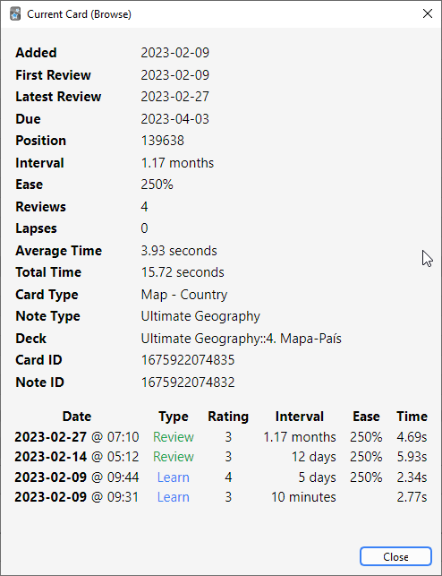
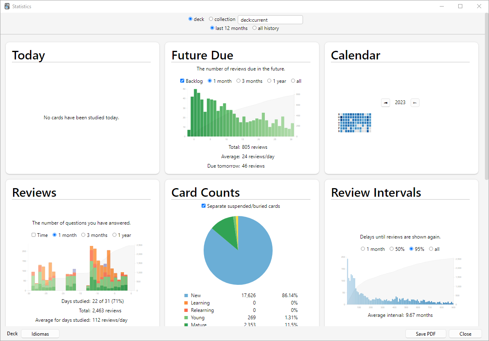

# 卡片信息、图表和统计

<!-- toc -->

## 卡片信息

你可以通过使用卡片&gt;信息菜单项，通过右键单击卡片然后选择 **信息**，或在复习界面按 <kbd>I</kbd> 来
显示一张卡片的信息。

几点说明：

**位置**\
它显示了卡片相对于其他新卡片出现的顺序。位置可以在浏览器中更改。一旦卡片已被学习，位置将不会使用，除
非将卡片手动重置为新卡。

**间隔**\
从一次复习到下一次复习的延迟。时间是缩写的；「0 秒，1 分，3 小时，4 天，5 个月，6 年」分别代表秒、分
钟、小时、天、月和年。

**简易度**\
当你用「良好」按钮回答复习卡片时，间隔的大致增长倍数。

底部部分显示了卡片的复习历史。评分表示按钮（1 = 重来，4 = 简单）。当卡片通过「重置」或「设置到期日
期」动作手动重新安排时，类型将列为手动，评分为 0。

## 统计

通过单击主窗口顶部的**统计**按钮，或按 <kbd>T</kbd> 可以访问统计窗口。

## 选择牌组 / 集合

### 牌组

默认情况下，统计窗口将显示当前选择的牌组及其可能包含的任何子牌组的统计信息，但你可以通过在屏幕顶部的
文本框中输入其名称来从集合中选择任何牌组，或者（从 Anki 2.1.61 开始），使用底部的牌组选择器选择。

### 集合

如果你选择此复选框，则将显示整个集合的统计信息。你还可以通过在顶部的搜索框中添加过滤器来显示任意搜索
的图表（2.1.28+）。

### 历史

默认情况下，Anki 2.1.28+ 将显示过去 12 个月的统计信息。你可以在顶部将其更改为所有历史范围或牌组生命
期范围。（顶部的「今天」部分当然不受这个选择的影响。）

较早版本的 Anki 默认会显示上个月的统计信息。你可以在底部将其更改为一年范围或牌组生命期范围。（同样，
顶部的「今天」部分不受此选择影响。）

### 更多

- 单击底部的「保存为 PDF」将统计信息的 PDF 文档保存到桌面上的文件中，以便于与你人分享统计信息。

- 当你删除笔记时，其复习历史仍会保留在 Anki 中。查看特定牌组的统计信息时将不会包含这些历史（因为
  Anki 无法知道删除的卡片属于哪个牌组），但查看整个集合的统计信息时将包含这些历史。

- Anki 2.1.28+ 引入了重新设计的图表。通过 <kbd>Shift</kbd> 单击统计按钮可以仍然访问旧图表。

## 今天

统计窗口顶部是一个简要的文本统计列表，显示你今天完成的复习。在这个上下文中，「复习」是指「一次卡片的
回答」，所以如果卡片需要多次查看，那么它可能会被算作多次复习，而回答过的学习卡片也算作「复习」。一些
可能不太直观的统计数据：

**重来次数**\
这是你失败的复习（即按下重来）的次数。后面列出的正确百分比是你「未」失败的卡片数量与你学习的卡片总数
之比。

**学习、复习、重新学习、已筛选**\
这是学到的卡片、复习卡片、重新学习卡片，或在未到期时在筛选牌组中学习的复习数量。

当天的统计数据不是你学习进展的良好总体指标；每个人都有不好的日子和好的日子，看到某一天的正确百分比较
低不应该引起担忧。其余统计数据将考虑更长的时间段，如果你希望根据表现来调整学习习惯或计划设置，这将会
提供更有用的信息。

「今天」的统计数据不受窗口底部选择的时间范围影响。

## 图表

**预测**\
此图表显示如果你不学习新卡片且没有卡片失败，未来某一天预计到期的复习数。柱状图和左轴显示每天到期的卡
片数，即如果你每天都学习所有卡片的话，而线图和右轴则显示如果直到那时你完全不学习，每天到期的卡片数。
请注意，预测图不计算当前逾期的复习，因此如果你有大量积压，逾期卡片将不显示。

**日程表**\
此图表显示过去的卡片复习活动。将鼠标悬停在特定项目上可以查看当天的复习次数。单击星期几可以设置为开始
日。

**复习次数**\
此图表统计你已完成的卡片复习次数。柱状图可能对应的时间段为天、周或月，具体取决于你在屏幕底部选择的时
间段。不同颜色的块显示你每天回答的卡片中有多少是[已熟练](getting-started.md#卡片类型)、欠熟练、重新
学习或学习卡片。还有一个单独的组用于在筛选/死记硬背牌组中回答的卡片，这些卡片在当时未到期。线图和右
轴则显示随时间推移的每种类型的复习累积总数（所以在 0 天时会显示图表显示的整个时间段的数字）。

**卡片数量**\
这个饼状图显示你的牌组或集合中未学习、学习中、欠熟练、已熟练和已搁置/暂停的卡片的百分比。如果你希望
计算更精确的百分比，图例显示了每个部分中的卡片确切数量，卡片总数显示在旁边。

**复习时间**\
这个图表的工作原理与复习计数相同，只不过它处理的是你花在每张卡片上的时间，而不是回答的卡片数量。

**复习间隔**\
该图表显示具有给定间隔（两次复习之间的延迟）的卡片数量。线图和右轴告诉你间隔小于或等于该点以下时间的
卡片百分比。时间范围对该图表的影响不同于其他图表：与其更改包含哪些卡片或学习期间，它限制显示间隔的远
度（因此 14 个月的间隔在一年图表上根本不显示）。

**卡片简易度**\
此图表显示具有特定简易度系数的卡片数量。所选牌组/集合的平均简易度也在此显示。

**逐小时分析**\
此图表显示在给定时间内你总共通过了多少百分比的复习（即未按重来）。较大、较深的条和左轴显示成功率；较
细、较亮的条和右轴显示你在该小时内完成的复习数量（这样你就知道结果有多重要）。

**回答按钮**\
此图表显示在学习新/学习卡片、年轻卡片和[成熟](getting-started.md#卡片类型)卡片时你选择「再试」、「困
难」、「好」或「简单」按钮的次数。Anki 还显示每种类型卡片的正确复习百分比。

## 手动分析

如果你对获取 Anki 提供的信息之外的统计数据感兴趣，可以直接访问数据。由于涉及的复杂性，我们无法为此提
供任何支持。

一个选项是[编写一个插件](addons.md)，以在统计窗口中添加其他图表或更多详细信息。AnkiWeb 上已经有几个
这样的插件，你可以查看了解其工作方式。

一个更强大且更复杂的选项是直接从 Anki 的数据库中提取复习日志信息并在外部程序中分析它。Anki 使用一种
称为 SQLite 的数据库格式。有许多工具可用于处理 SQLite 数据库；一个最简单的入门工具叫做
[SQLite Browser](http://sqlitebrowser.org/)，它允许你查看数据库并导出 CSV 版本的表，以便导入到其他程
序中。

统计数据中最重要的表是「revlog」表，它存储了你进行的每次复习的条目。各列如下：

**id**\
复习进行时的时间，以自 1970 年 1 月 1 日午夜 UTC 起经过的毫秒数。（这有时被称为「Unix 纪元时间」，特
别是以秒而不是毫秒为单位时。）

**cid**\
已复习卡片的 ID。你可以在「cards」表的 id 字段中查找此值以获取更多关于卡片的信息，不过请注意卡片在记
录 revlog 条目和你查它的时候可能已经更改。也就是卡片创建时间的毫秒时间戳。

**usn**\
此列用于跟踪复习的同步状态，对分析没有有用的信息。

**ease**\
复习结束时你按下的按钮（1 为重来，4 为简单）。

**ivl**\
复习后卡片被推到的新间隔。正值为天；负值为秒（用于学习卡片）。

**lastIvl**\
卡片复习前的间隔。首次引入的卡片的最后一次间隔等于「重来」延迟。

**factor**\
卡片的新简易度系数，以每千分之几为单位。如果简易度系数为 2500，下次你按「良好」时卡片间隔将乘以
2.5。

**time**\
你在选择评分按钮之前花在卡片的问答两面上的时间（以毫秒为单位）。

**type**\
学习卡片为 0，复习卡片为 1，重新学习卡片为 2，提前学习卡片为 3（这些卡片在它们未到期时在筛选牌组中进
行学习）。
